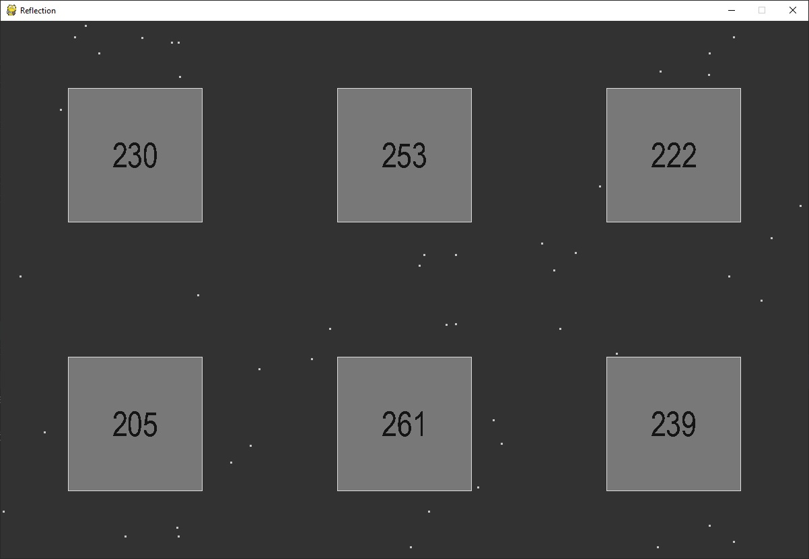

# Reflection

Небольшой проект, написанный за пару вечеров. Не более, чем небольшое занимательное упражнение для отработки навыков программирования.
Суть: в окне-коробке есть несколько десятков точек-светлячков, движущихся внутри. Они отскакывают от стенок коробки (границ окна) и от шести квадратов-препятствий.
Внутри каждого квадрата счетчик: он показывает сколько уже раз светлячки ударялись о его стенки.

Классы: Sparkle (Светлячок), Segment (Отрезок, от которого светлячки отскакывают), Box (Квадрат со счетчиком)

